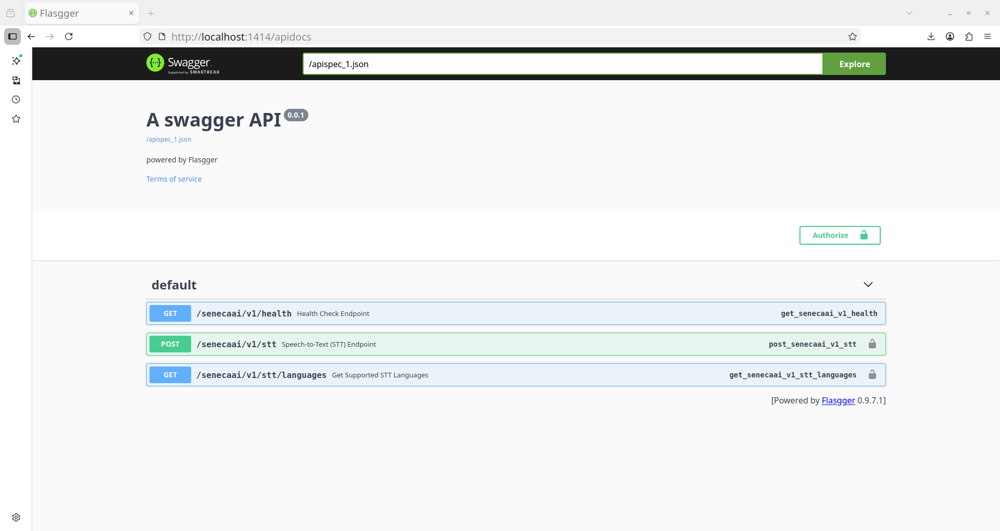

# Seneca AI: Docker containers

Seneca uses Docker containers to run the various services that make up its architecture

> [**Docker**](https://www.docker.com/) is a platform designed to help developers build, share, and run container applications. 
> It handle the tedious setup, so you can focus on the code.

## Ollama container

Container that runs [Ollama](https://ollama.com/), a free open-source tool that allows you to install and run 
artificial intelligence models (such as Llama 3, DeepSeek or Gemma) directly on your own computer. 
Instead of relying on cloud services like ChatGPT, it processes everything locally.

The AI model/s installed depends on the hardware available in your PC/laptop and the user choice.
These are the models suggested during the installation:

| Ram   | GPU	  | Modelo IA                   |
|-------| ------ | --------------------------- |
| 8 Gb	 | No	  | qwen2.5:1.5b o llama3.2:1b  |
| 8 Gb	 | Yes	  | qwen2.5:3b o qwen2.5:1.5b   |
| 16 Gb | No	  | qwen2.5:3b o llama3.2:3b    |
| 16 Gb | Yes	  | mistral:7b o llama3:8b      |
| 32 Gb | No	  | llama3:8b o gemma2:9b       |
| 32 Gb | Yes	  | qwen2.5:14b o phi3:14b      |
| 64 Gb | No	  | llama3:8b o command-r:35b   |
| 64 Gb | Yes	  | mixtral:8x7b o llama3.1:70b |

## API container

Container that exposes a REST API used by Seneca AI:

 - `GET` **/senecaai/v1/health** Health Check Endpoint
 - `POST` **/senecaai/v1/stt** Speech-to-Text (STT) Endpoint
 - `GET` **/senecaai/v1/stt/languages** Get Supported STT Languages

To see the Swagger API documentation, access to [http://localhost:1414/apidocs](http://localhost:1414/apidocs)
when Seneca AI is running:

## MongoDB container (Coming soon)

Container that runs MongoDB to maintain the historic of chats between Seneca AI and the user.

> **What is MongoDB?**
> 
> MongoDB is a document database that offers high scalability and flexibility, 
> as well as an advanced query and indexing model.